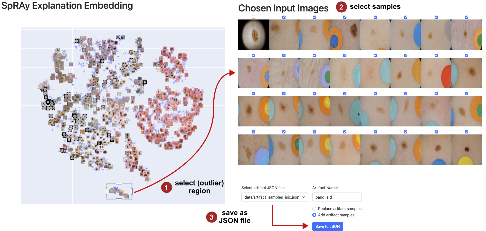
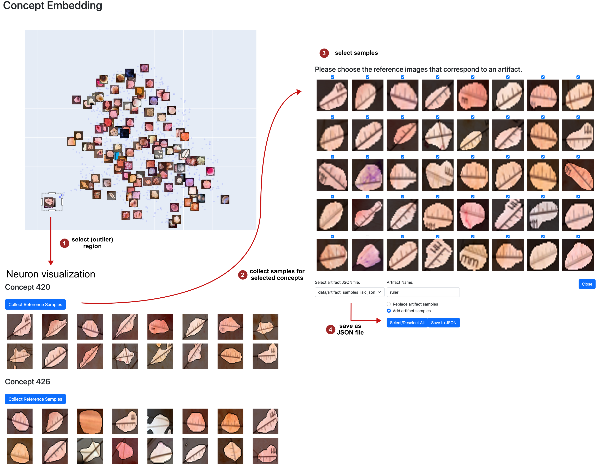

# Concept Validation

For the identification of model weaknesses, we distuingish between the data perspective and the model perspective. Both operate on input or latent activations or relevance scores, commonly in aggregated manner, for instance by applying max-pooling. Thus, all considered approaches can be run using the same pre-computed data. Whereas the data perspective computes pair-wise similarities between samples, thereby finding odd samples, the model perspective computes pair-wise similarities between neurons to identify outlier neuron/concept representations. 

<div align="center">
    
    <p>Data- vs. concept perspective for concept validation</p>
</div>

The approaches implemented in this repository include:
1. Data Perspective:
    - Spectral Relevance Analysis (SpRAy)
2. Model Perspective
    - Activation pattern: Data-agnOstic Representation Analysis (DORA)
    - Relevance pattern: Clustering of latent relevance scores


## Interactive Analysis
*Prerequisite: Pre-computed tensors as described [here](../../README.md#preprocessing).*

We provide a [dash](https://dash.plotly.com/)-based app to interactively explore the low-dimensional representations both from the data perspective and the model perspective. 

Detected neurons encoding spurious concepts for investigated models are maintained in [../../data/spurious_neurons.json](../../data/spurious_neurons.json).
Biased samples are provided in [../../data/artifact_samples](../../data/artifact_samples).
Note, that while provided neuron annotations are model-dependant, i.e., they are only valid for our pre-trained models, sample annotations can be re-used for other architectures/model checkpoints too, e.g., to train new CAVs.

### Data perspective: Identifying outlier samples via SpRAy

In the following, we will investigate the ResNet50 model trained on ISIC2019 using latent relevances/activations after the third residual bock. First, run the following command to run the SpRAy preprocessing for the classes 0 (Melanoma) and 1 (Melanocytic nevus):

```bash 
CONFIG=config_files/revealing/isic/local/resnet50d_identity_2.yaml
python -m experiments.preprocessing.run_spray_preprocessing --config_file $CONFIG --class_indices "0,1"
```

Now, using the pre-computed features, we can explore the low-dimensional sample embedding to detect suspicious outlier samples, potentially encoding spurious correlations. Run the following to start the tool:

```bash 
python experiments/reveal/spray/plot_spray_embedding_plotly.py --config_file  $CONFIG --class_id 1
```

<div align="center">
    
    <p>Interactive SpRAy tool for the identification of outlier <i>samples</i>  for class NV in ISIC2019. Selected samples can be exported to a JSON files.</p>
</div>

The UI can be accesses via `http://localhost:8051` The user can select a section of the embedding, inspect the samples within that area and, if they contain spurious concepts, export the sample-IDs to a `.JSON`-file with a chosen name. This allows to quickly annotate the data on sample-level.

### Model perspective (1/2): Analyzing Activation Pattern via DORA

Make sure to run the CRP-preprcessing script beforehand, as this generates the data required for Feature Visualization techniques like RelMax, to visualize neurons in a human-interpretable manner:

```bash
python -m experiments.preprocessing.run_crp_preprocessing --config_file $CONFIG
```

To identify odd neurons, DORA requires the activation of generated ActMax samples for each neuron. This can be quite costly, depending on the number of iterations for the generator, determining the quality of generated input samples. 

Having generated these samples via

```bash
python -m experiments.preprocessing.run_dora_preprocessing --config_file $CONFIG
```

the interactive tool to explore the DORA embedding can be started (and accessed via `http://localhost:8051`) as follows:

```bash
python -m experiments.reveal.dora.plot_dora_interactive --config_file $CONFIG --class_id 1
```


### Model perspective (2/2): Analyzing Relevance Pattern via Relevance Clustering

In addition, we want to identify outlier neurons (concepts) by computing pair-wise distances between relevance scores. This allows the detection of neurons encoding concepts used in a unique manner, potentially caused by spurious correlations. 

To start the interactive tool at `https://localhost:8051`, run:

```bash
python -m experiments.reveal.crp.plot_concept_embedding_plotly --config_file $CONFIG --class_id 0
```
<div align="center">
    
    <p>Interactive concept clustering tool for the identification of outlier <i>concepts</i>  for class MEL in ISIC2019. Reference samples for selected concepts can be stored to a JSON files.</p>
</div>


## Prototypical Concept-based Explanations (PCX)

Lastly, combining both perspectives, PCX aims to identify prototypical explanations represented as distribution over concepts. These can be computed as follows: 

```bash
python -m experiments.reveal.pcx.plot_prototypes_with_concepts --config_file $CONFIG --class_id 0
```
