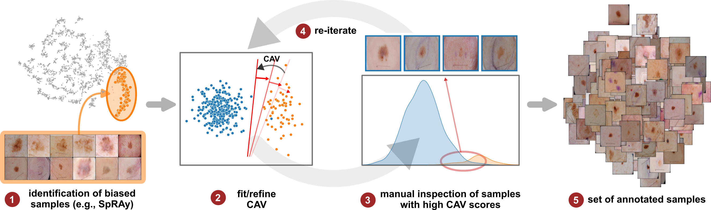
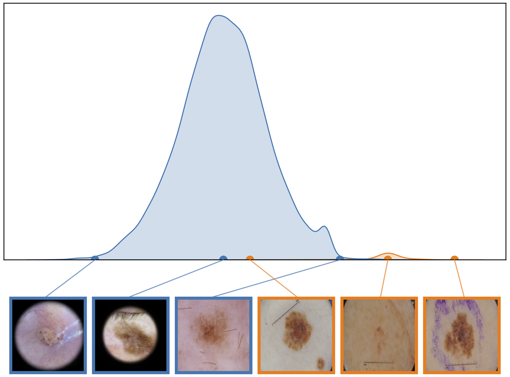
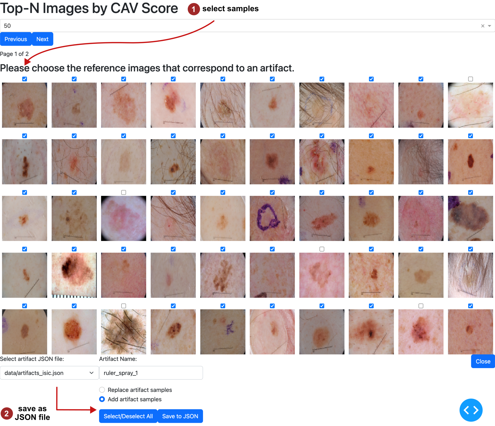

# Bias Modeling and Biased Sample Retrieval

The bias modeling step is an iterative approach itself and concept representations can be improved by correcting labeling errors in the data.
In this process, samples with high bias scores are manually inspected to enhance label quality. The steps include:
1. Starting with a small set of bias samples identified through concept validation methods (see above).
2. Fitting an initial Concept Activation Vector (CAV).
3. Manually inspecting samples with high bias scores to improve labels.
4. Using the updated labels to iteratively refine the CAV
5. This results in a set of annotated bias samples.

Refer to the figure below for a visual representation of this process.

<div align="center">
    
    <p>Iterative bias modeling and sample retrieval.</p>
</div>

### Interactive Sample Retrieval
We assume that a first, initial set of biased samples has been identified, for instance using our interactive tools for SpRAy or concept clustering, as described in [experiments/reveal](../../experiments/reveal/README.md).
We assume that the sample IDs for the initial set is stored in the JSON file `data/artifact_samples_isic.json` with key `ruler_spray_v1`.
First, run the following to compute and plot the distribution of bias scores:
```bash
ARTIFACTS_FILE=data/artifacts_isic.json
ARTIFACT=ruler_spray_1
python experiments/sample_retrieval/run_biased_sample_ranking.py --config_file config_files/revealing/isic/local/resnet50d_identity_2.yaml --artifacts_file $ARTIFACTS_FILE --artifact $ARTIFACT
```

This will output a figure plotting the distribution of CAV scores, as shown below.

<div align="center">
    
    <p>Distribution of CAV scores for samples labeled as artifact (orange) and other samples (blue).</p>
</div>


To follow the iterative bias modeling and sample retrieval process, we developed an interactive tool that can be started as follows: 

```bash
CONFIG=config_files/revealing/isic/local/resnet50d_identity_2.yaml
python experiments/sample_retrieval/run_cav_based_sample_retrieval_plotly.py --config_file $CONFIG --artifacts_file $ARTIFACTS_FILE --artifact $ARTIFACT
```

Given the provided sample IDs, the tool fits a CAV, computes bias/CAV scores for all other samples and presents them to the user in descending order (i.e, samples with high scores first). These samples are likely to contain the targeted bias. The decision is up to the user, who can select/deselect samples and store them in the provided JSON file. This process can be repeated iteratively, with improved bias representations (CAVs) in each step. The tool is visualized below.

<div align="center">
    
    <p>Interactive data annotation tool.</p>
</div>